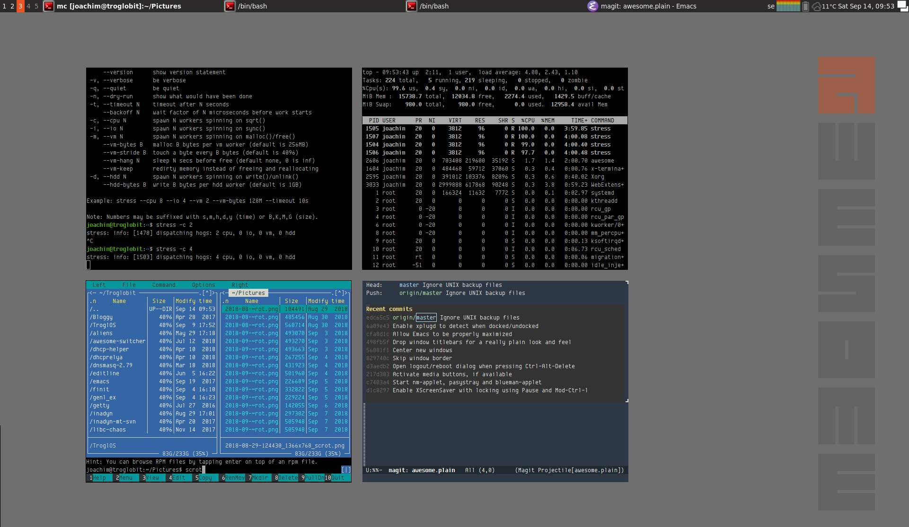

## Requirements

- awesome
- acpi
- python-gtk2 / pygtk
- xplugd
- xscreensaver
- nm-applet
- pasystray
- blueman-applet
- lua-socket

For the weather widget you need an API key, which can be created for
free here: <https://openweathermap.org/apikey>.  Place the key in your
`~/.xprofile`, which is sourced in Ubuntu and Debian derived distros by
X when starting Awesome:

```sh
export AWW_WEATHER_API_KEY=321039232132103922132132910310bc
```

